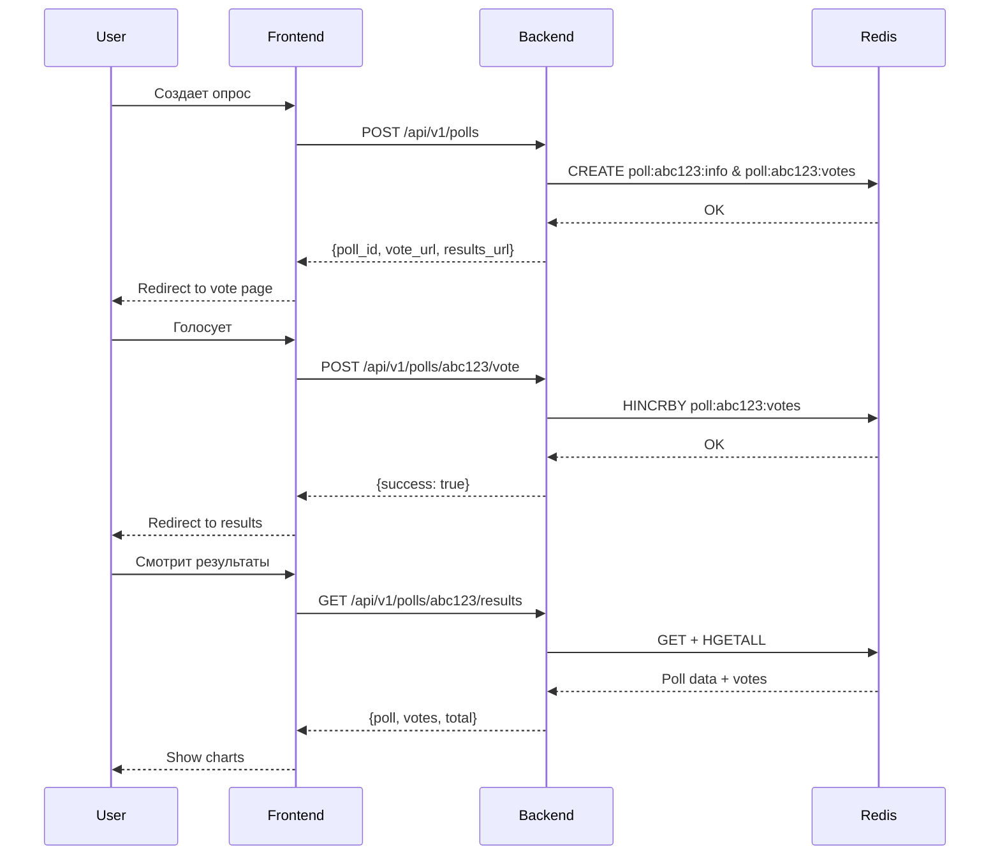

# 📡 API Documentation

Полная документация REST API для Surway сервиса.

---

## 🌐 Base URL

**Development:**
```
http://localhost:8080/api/v1
```

**Production:**
```
https://your-domain.com/api/v1
```

---

## 📚 Swagger UI

Интерактивная документация доступна по адресу:

```
http://localhost:8080/swagger/index.html
```

Swagger UI позволяет:
- Просматривать все endpoints
- Тестировать запросы прямо из браузера
- Видеть схемы данных
- Экспортировать OpenAPI спецификацию

---

## 🔐 Authentication

**Текущая версия:** API не требует аутентификации

**В планах:**
- JWT tokens для личных кабинетов
- API keys для внешних интеграций

---

## 📋 Endpoints

### Health Check

#### `GET /health`

Проверка работоспособности сервиса.

**Response:**
```json
{
  "status": "ok"
}
```

**Status Codes:**
- `200` — сервис работает

---

### Create Poll

#### `POST /api/v1/polls`

Создать новый опрос.

**Request Body:**
```json
{
  "title": "Какие языки программирования вы используете?",
  "options": [
    "Go",
    "Python",
    "JavaScript",
    "Rust",
    "TypeScript"
  ]
}
```

**Validation Rules:**
- `title`: обязательное, 3-200 символов
- `options`: массив из 2-10 элементов, каждый элемент 1-100 символов

**Response:**
```json
{
  "poll_id": "abc123",
  "vote_url": "http://localhost:8080/api/v1/polls/abc123/vote",
  "results_url": "http://localhost:8080/api/v1/polls/abc123/results"
}
```

**Status Codes:**
- `201` — опрос успешно создан
- `400` — невалидные данные
- `500` — внутренняя ошибка сервера

**Error Response:**
```json
{
  "error": "invalid_request",
  "message": "Title is required"
}
```

**cURL Example:**
```bash
curl -X POST http://localhost:8080/api/v1/polls \
  -H "Content-Type: application/json" \
  -d '{
    "title": "Какие языки программирования вы используете?",
    "options": ["Go", "Python", "JavaScript", "Rust", "TypeScript"]
  }'
```

---

### Vote

#### `POST /api/v1/polls/{id}/vote`

Проголосовать в опросе (поддерживается множественный выбор).

**Path Parameters:**
- `id` (string, required) — ID опроса

**Request Body:**
```json
{
  "option_indices": [0, 2, 4]
}
```

**Validation Rules:**
- `option_indices`: массив индексов, минимум 1 элемент
- Каждый индекс должен быть >= 0 и < количества опций
- Индексы должны быть уникальными (нельзя голосовать за одну опцию дважды)

**Response:**
```json
{
  "success": true,
  "message": "Votes registered successfully (3 options)"
}
```

**Status Codes:**
- `200` — голос успешно зарегистрирован
- `400` — невалидные данные / дубликат индекса
- `404` — опрос не найден или истек
- `500` — внутренняя ошибка сервера

**Error Responses:**

*Poll not found:*
```json
{
  "error": "poll_not_found",
  "message": "Poll not found or expired"
}
```

*Invalid option index:*
```json
{
  "error": "invalid_option",
  "message": "Invalid option index"
}
```

*Duplicate option:*
```json
{
  "error": "duplicate_option",
  "message": "Cannot vote for the same option multiple times"
}
```

**cURL Example:**
```bash
curl -X POST http://localhost:8080/api/v1/polls/abc123/vote \
  -H "Content-Type: application/json" \
  -d '{
    "option_indices": [0, 2, 4]
  }'
```

**Примечания:**
- Можно голосовать за одну опцию: `"option_indices": [0]`
- Можно голосовать за несколько: `"option_indices": [0, 1, 3]`
- В текущей версии нет защиты от повторного голосования
- Каждый запрос увеличивает счетчики выбранных опций

---

### Get Results

#### `GET /api/v1/polls/{id}/results`

Получить результаты опроса.

**Path Parameters:**
- `id` (string, required) — ID опроса

**Response:**
```json
{
  "poll": {
    "id": "abc123",
    "title": "Какие языки программирования вы используете?",
    "options": [
      "Go",
      "Python",
      "JavaScript",
      "Rust",
      "TypeScript"
    ],
    "created_at": "2025-12-08T10:00:00Z",
    "expires_at": "2025-12-15T10:00:00Z"
  },
  "votes": {
    "Go": 42,
    "Python": 28,
    "JavaScript": 35,
    "Rust": 15,
    "TypeScript": 30
  },
  "total": 150
}
```

**Status Codes:**
- `200` — результаты успешно получены
- `404` — опрос не найден или истек
- `500` — внутренняя ошибка сервера

**Error Response:**
```json
{
  "error": "poll_not_found",
  "message": "Poll not found or expired"
}
```

**cURL Example:**
```bash
curl http://localhost:8080/api/v1/polls/abc123/results
```

---

## 🔄 Типичные флоу

### Полный жизненный цикл опроса



---

## 📊 Data Models

### Poll

```typescript
interface Poll {
  id: string;              // Уникальный ID (7 символов)
  title: string;           // Название опроса
  options: string[];       // Варианты ответа
  created_at: string;      // ISO 8601 timestamp
  expires_at: string;      // ISO 8601 timestamp
}
```

### CreatePollRequest

```typescript
interface CreatePollRequest {
  title: string;           // 3-200 символов
  options: string[];       // 2-10 элементов, каждый 1-100 символов
}
```

### CreatePollResponse

```typescript
interface CreatePollResponse {
  poll_id: string;         // Сгенерированный ID
  vote_url: string;        // URL для голосования
  results_url: string;     // URL для результатов
}
```

### VoteRequest

```typescript
interface VoteRequest {
  option_indices: number[];  // Массив индексов, минимум 1
}
```

### VoteResponse

```typescript
interface VoteResponse {
  success: boolean;        // true если успешно
  message?: string;        // Опциональное сообщение
}
```

### PollResults

```typescript
interface PollResults {
  poll: Poll;              // Метаданные опроса
  votes: {                 // Карта: название опции -> количество голосов
    [option: string]: number;
  };
  total: number;           // Общее количество голосов
}
```

### ErrorResponse

```typescript
interface ErrorResponse {
  error: string;           // Код ошибки (snake_case)
  message?: string;        // Человекочитаемое описание
}
```

---

## ⚡ Rate Limiting

**Текущая версия:** Rate limiting не реализован

**В планах:**
- 100 requests/minute для создания опросов
- 1000 requests/minute для голосования
- Unlimited для получения результатов

---

## 🔒 CORS

API поддерживает CORS для всех origins:

```
Access-Control-Allow-Origin: *
Access-Control-Allow-Methods: POST, OPTIONS, GET, PUT, DELETE
Access-Control-Allow-Headers: Content-Type, Authorization, ...
```

**Production:** рекомендуется ограничить `Allow-Origin` вашим доменом.

---

## 🐛 Error Codes

| Error Code | HTTP Status | Описание |
|-----------|-------------|----------|
| `invalid_request` | 400 | Невалидные входные данные |
| `poll_not_found` | 404 | Опрос не найден или истек |
| `invalid_option` | 400 | Невалидный индекс опции |
| `duplicate_option` | 400 | Дубликат индекса в option_indices |
| `internal_error` | 500 | Внутренняя ошибка сервера |

---

## 📝 Best Practices

### Для клиентов API

1. **Проверяйте HTTP статусы** перед парсингом ответа
2. **Обрабатывайте 404 ошибки** — опрос может истечь
3. **Используйте exponential backoff** при 500 ошибках
4. **Кешируйте результаты** если они не меняются часто
5. **Валидируйте данные** на клиенте перед отправкой

### Интеграция

**JavaScript/TypeScript:**
```typescript
const API_URL = 'http://localhost:8080/api/v1';

async function createPoll(title: string, options: string[]) {
  const response = await fetch(`${API_URL}/polls`, {
    method: 'POST',
    headers: { 'Content-Type': 'application/json' },
    body: JSON.stringify({ title, options }),
  });

  if (!response.ok) {
    const error = await response.json();
    throw new Error(error.message || 'Failed to create poll');
  }

  return await response.json();
}
```

**Python:**
```python
import requests

API_URL = 'http://localhost:8080/api/v1'

def create_poll(title: str, options: list[str]) -> dict:
    response = requests.post(
        f'{API_URL}/polls',
        json={'title': title, 'options': options}
    )
    response.raise_for_status()
    return response.json()
```

**Go:**
```go
type CreatePollRequest struct {
    Title   string   `json:"title"`
    Options []string `json:"options"`
}

func createPoll(title string, options []string) (*CreatePollResponse, error) {
    body, _ := json.Marshal(CreatePollRequest{Title: title, Options: options})
    resp, err := http.Post(
        "http://localhost:8080/api/v1/polls",
        "application/json",
        bytes.NewBuffer(body),
    )
    // ... handle response
}
```

---

## 🧪 Testing

### Postman Collection

Можно импортировать Swagger spec в Postman:
```
http://localhost:8080/swagger/doc.json
```

### Manual Testing

**1. Создать опрос:**
```bash
POLL_ID=$(curl -s -X POST http://localhost:8080/api/v1/polls \
  -H "Content-Type: application/json" \
  -d '{"title":"Test","options":["A","B","C"]}' \
  | jq -r '.poll_id')

echo "Poll ID: $POLL_ID"
```

**2. Проголосовать:**
```bash
curl -X POST http://localhost:8080/api/v1/polls/$POLL_ID/vote \
  -H "Content-Type: application/json" \
  -d '{"option_indices":[0,2]}'
```

**3. Получить результаты:**
```bash
curl http://localhost:8080/api/v1/polls/$POLL_ID/results | jq
```

---

## 🔮 Planned Endpoints

Планируется добавить:

- `GET /api/v1/polls/{id}` — получить метаданные опроса без голосов
- `DELETE /api/v1/polls/{id}` — удалить опрос (требует auth)
- `GET /api/v1/polls` — список опросов пользователя (требует auth)
- `PATCH /api/v1/polls/{id}` — изменить настройки опроса
- `GET /api/v1/polls/{id}/export` — экспорт результатов (CSV, PDF)
- `WebSocket /api/v1/polls/{id}/live` — live обновления результатов

---

## 📞 Support

- **Swagger UI:** http://localhost:8080/swagger/index.html
- **GitHub Issues:** https://github.com/AlexeyLars/surway/issues
- **Backend Source:** `backend/internal/handler/poll.go`

---

_Последнее обновление: December 2025_
